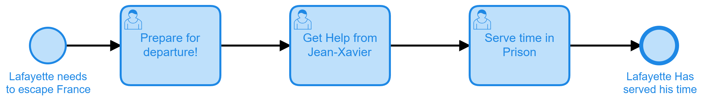
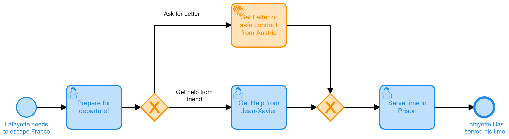
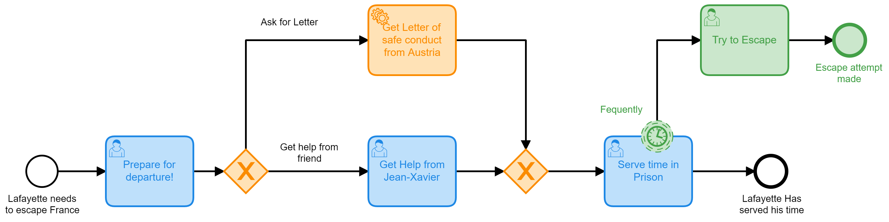
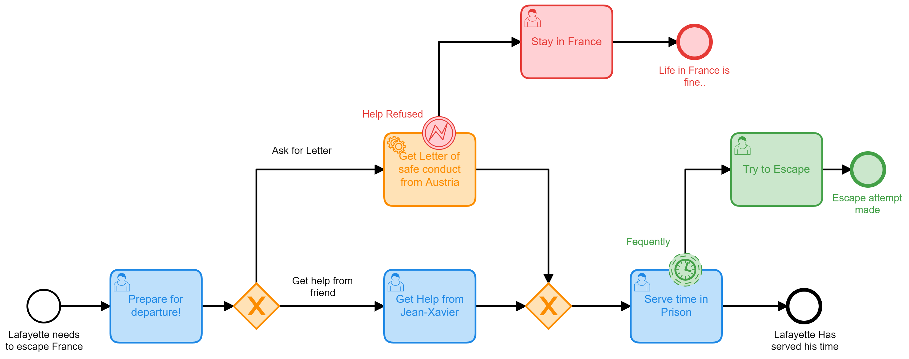

# Camunda Run Tutorial Lafayette

This project is used as part of a video tutorial in order to show how you can build a Camunda process for the Camunda Platform Run distribution.

 

## What is this all about?
In other examples I've created a process to help [Gilbert du Motier, Marquis de Lafayette](https://en.wikipedia.org/wiki/Gilbert_du_Motier,_Marquis_de_Lafayette) get involved in his favorite pass time of overthrowing monarchies. Now it's only fair that we help him as he tries to escape revolutionary France. 

The process is broken up into 4 parts and in the end our dear friend Lafayette will not be able to escape some kind of incarceration, but at least we can get him there will some efficiency. 

## What You will Need
* [Java JDK 11](https://www.oracle.com/java/technologies/javase-jdk11-downloads.html) so that you can run Camunda Platform Run
* [Camunda Platform Run](https://camunda.com/download/) for running BPMN models
* [Camunda Modeler](https://camunda.com/download/modeler/) for building and deploying BPMN Models
* [NodeJS](https://nodejs.org/en/download/) for running JavaScript external task workers.
* Some kind of developer tooling like [Visual Studio Code](https://code.visualstudio.com/) 

## What You will Learn
* Setup a Camunda Platform Run project
* Understand all the required components
* How to create forms for User Tasks
* How to create [External Task Workers](https://docs.camunda.org/manual/latest/user-guide/process-engine/external-tasks/) in JavaScript
* How to configure XOR gateways based on process data
* How to configure non-interupting timer events
* How to catch BPMN errors thrown from a JavaScript Worker

## Part One: Lafayette Prepares for Escape
Creating Camunda forms to be used in User Tasks

## Part Two: Lafayette sends for help
Creating an XOR gateway and adding a [JavaScript worker](https://github.com/NPDeehan/Camunda-Run-Tutorial-Lafayette/blob/main/Worker/SendLetterToAustria.js)

## Part Three: Lafayette tries to escape
Use a timer and a boundary event on a user task

## Part Four
Throw an error with from a [JavaScript worker](https://github.com/NPDeehan/Camunda-Run-Tutorial-Lafayette/blob/main/Worker/SendLetterToAustriaError.js) and catch it on a boundary event

